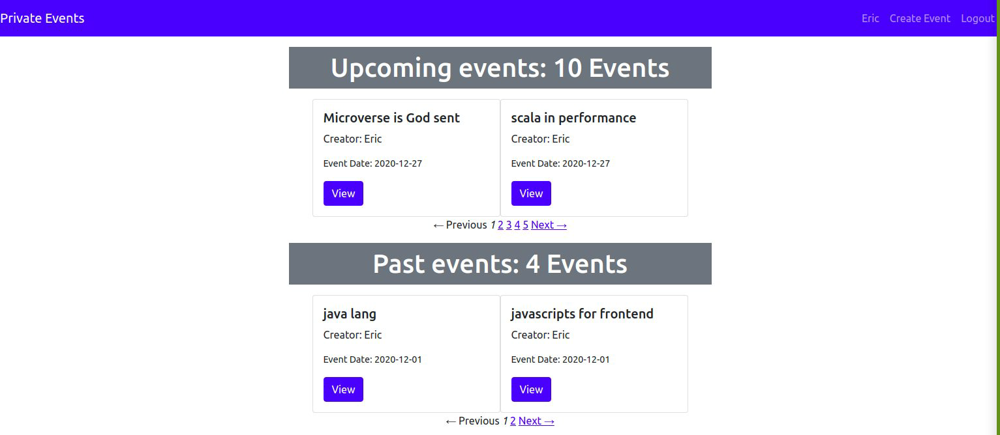
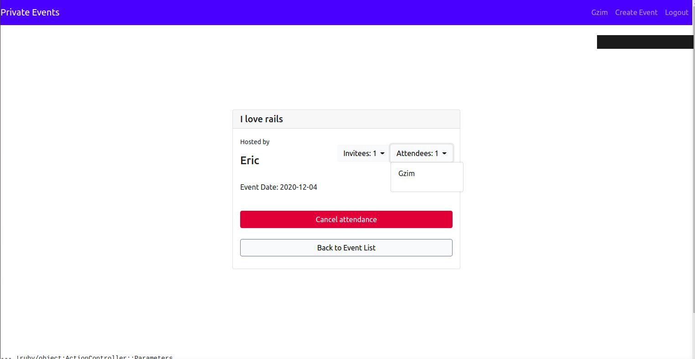

# Project: Private Events

### What's this

A project completed as part of [The Odin Ruby on Rails Learning Track](https://www.theodinproject.com/courses/ruby-on-rails/lessons/associations) to dive into ActiveRecord’s associations. The project involves building a private website with similar functionality to the well known event organization and management platform [Eventbrite](https://www.eventbrite.com/).

### Functionality

As far as this is a training app with focus on ActiveRecord's associations, User authentication and authorization are extremely barebone with no validations or real security of access: no need for a password, anyone is able to sign in/sign up through a basic hand-rolled authentication by their name. After the registration/login they're able to create events, invite other users as well as to enroll for events organized by others. Always because it's an exercise, users can create and enroll for the events with the past dates to practice rails' scopes. In a similar vein, just strictly necessary RESTful actions were implemented in the controllers: for example, you can't edit/delete users/events. Nevertheless, the styling was not requested, we built a minimalistic design using `bootstrap` gem, a CSS framework based on Flexbox.

## Built With

- Ruby on Rails
- Rspec gem
- Capybara gem
- Bootstrap
- sqlite 3
- VScode
- Rubocop


### Screenshots

<p float = 'left'>
    
    
</p>

### Getting started

To get started with the app, make sure you have Rails and Git installed on your machine  
Clone the repo to your local machine: 
```ruby
$ git clone https://github.com/Ceejayski/Private-events.git
```
Then, install the needed gems:
```ruby
$ bundle install
```
Next, migrate the database:
```ruby
$ rails db:migrate
```
If you want to load sample users and events, use seeds:
```ruby
$ rails db:seed
```
Finally, on root path run a local server:
```ruby
$ rails server
```
Open browser to view application:
```ruby
localhost:3000
```


## Author

👤 **Okoli Chijioke**
- Github: [@Ceejayski](https://github.com/ceejayski)
- Twitter: [@Ceejaski1](https://twitter.com/Ceejayski1)
- Linkedin: [Okoli Chijioke](https://www.linkedin.com/in/okoli-ceejay/)

👤 **Eric Enaburekhan**

- Github: [@enaburekhan](https://github.com/enaburekhan)
- Twitter: [@enaburekhaneric](https://twitter.com/enaburekhaneric)
- Linkedin: [@ericenaburekhan](https://www.linkedin.com/in/eric-enaburekhan-801a28100/)

memo License
This project is MIT licensed.

## 🤝 Contributing

Contributions, issues and feature requests are welcome!

## Show your support

Give a ⭐️ if you like this project!

## Acknowledgments

- Microverse